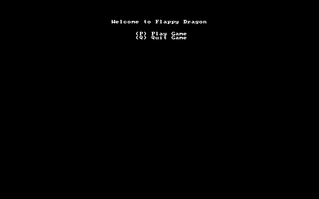
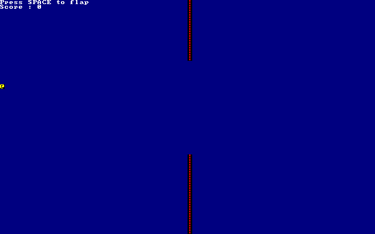

FlappyTerm
###

This is a tiny game built suing only assci-charachters and [bracket-lib](https://crates.io/crates/bracket-lib).

It is part the Hand-On-Rust book. Although the book is written for people getting started and was therefore did not have so much to for me, but it was relaxing to follow the book and just get more used to syntax that is rare in real world contributions I was doing.

